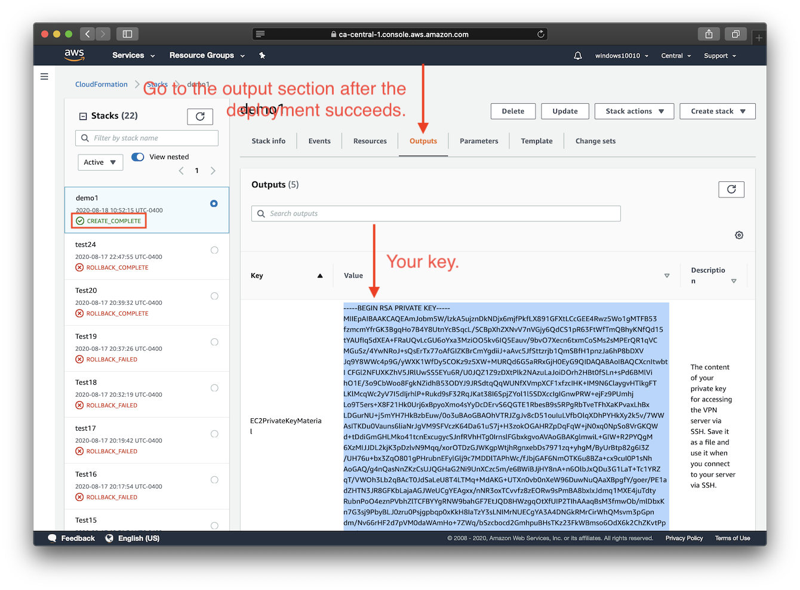
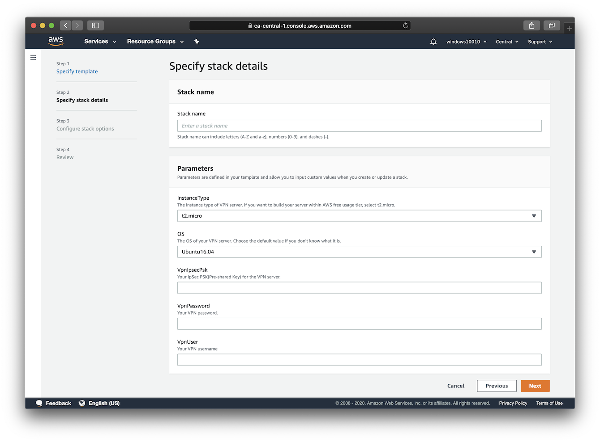

# Deploy to Amazon EC2 using CloudFormation (Beta)

> **Note:** This deployment template is still in **BETA**. You may encounter failures during deployment. In that case, please open a new issue.

This template will create a fully-working IPsec VPN server on Amazon Elastic Compute Cloud (Amazon EC2). Please make sure to check the EC2 [pricing details](https://aws.amazon.com/ec2/pricing/on-demand/) before continuing. Using a `t2.micro` server instance for your deployment may qualify for the [AWS Free Tier](https://aws.amazon.com/free/).

## Available customization parameters:

- Amazon EC2 instance type
- OS for your VPN server (Ubuntu 20.04/18.04/16.04, Debian 10/9)
> **Note:** Before using the Debian images on EC2, you need to first subscribe at the AWS Marketplace: [Debian 10](https://aws.amazon.com/marketplace/pp/B0859NK4HC), [Debian 9](https://aws.amazon.com/marketplace/pp/B073HW9SP3).
- Your VPN username
- Your VPN password
- Your VPN IPsec PSK (pre-shared key)

> **Note:** When choosing your VPN username, password and PSK, DO NOT use these special characters: `\ " '`.

Make sure to do this with an **AWS ROOT ACCOUNT** or an **IAM ACCOUNT** with **ADMINISTRATOR ACCESS**. 

Right-click this [**template link**](https://raw.githubusercontent.com/hwdsl2/setup-ipsec-vpn/master/aws/cloudformation-template-ipsec) and save as a file on your computer. Then upload it as the template source in the stack creation wizard.

At step 4, make sure to confirm that this template may create IAM resources.

Click the icon below to start:

You may choose an AWS region using the selector to the right of your account information on the navigation bar. After the stack is successfully created, click the **Outputs** tab to view your VPN login details. Then continue to [Next steps: Configure VPN Clients](../README.md#next-steps).

> **Note:** You will need to wait at least 5 minutes after the stack shows **CREATE_COMPLETE**, before you can connect to the server with a VPN client. This is to allow time for the VPN setup to complete.

## FAQs

How to connect to the server via SSH after deployment?

  
Amazon EC2 does not allow users to access the instances with an SSH password. Instead, users are instructed to create "key pairs", which are used as credentials to access the instances via SSH. 

This template generates a key pair for you during deployment, and the private key will be available as text under the **Outputs** tab after the stack is successfully created.

You will need to save the private key from the **Outputs** tab to a file on your computer, if you want to access the VPN server via SSH.

> **Note:** You may need to format the private key by replacing all spaces with newlines, before saving to a file.

## Author

Copyright (C) 2020 [S. X. Liang](https://github.com/scottpedia)

## Screenshots

