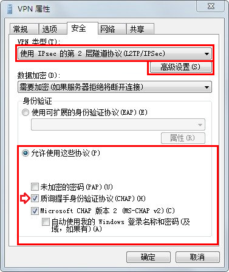
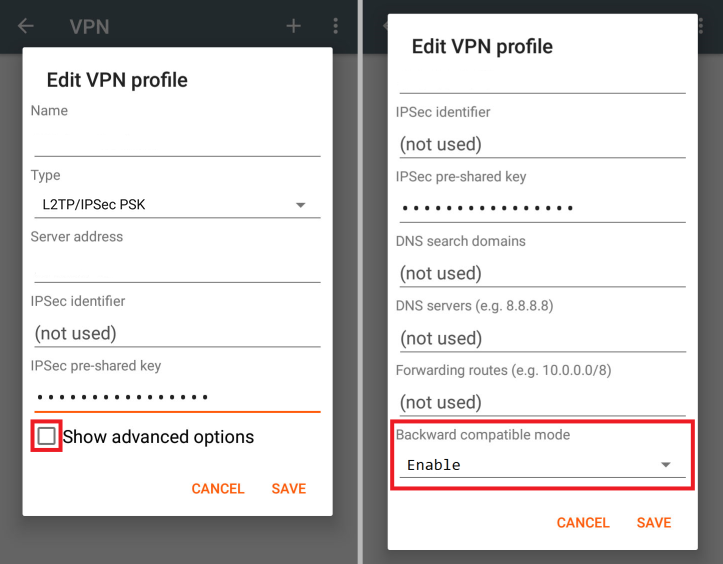

# 配置 IPsec/L2TP VPN 客户端

*其他语言版本: [English](clients.md), [简体中文](clients-zh.md).*

*注: 你也可以使用 [IPsec/XAuth 模式](clients-xauth-zh.md) 连接，或者配置 [IKEv2](ikev2-howto-zh.md)。*

在成功<a href="https://github.com/hwdsl2/setup-ipsec-vpn/blob/master/README-zh.md" target="_blank">搭建自己的 VPN 服务器</a>之后，你可以按照下面的步骤来配置你的设备。IPsec/L2TP 在 Android, iOS, OS X 和 Windows 上均受支持，无需安装额外的软件。设置过程通常只需要几分钟。如果无法连接,请首先检查是否输入了正确的 VPN 登录凭证。

另一个带图片的<a href="https://usefulpcguide.com/17318/create-your-own-vpn/" target="_blank">安装指南</a>可供参考，它由 Tony Tran 编写。

---
* 平台名称
  * [Windows](#windows)
  * [OS X (macOS)](#os-x)
  * [Android](#android)
  * [iOS (iPhone/iPad)](#ios)
  * [Chromebook](#chromebook)
  * [Windows Phone](#windows-phone)
  * [Linux](#linux)
* [故障排除](#故障排除)
  * [Windows 错误 809](#windows-错误-809)
  * [Windows 错误 628](#windows-错误-628)
  * [Android 6 and 7](#android-6-and-7)
  * [其它错误](#其它错误)
  * [额外的步骤](#额外的步骤)

## Windows

### Windows 10 and 8.x

1. 右键单击系统托盘中的无线/网络图标。
1. 选择 **打开网络与共享中心**。
1. 单击 **设置新的连接或网络**。
1. 选择 **连接到工作区**，然后单击 **下一步**。
1. 单击 **使用我的Internet连接 (VPN)**。
1. 在 **Internet地址** 字段中输入`你的 VPN 服务器 IP`。
1. 在 **目标名称** 字段中输入任意内容。单击 **创建**。
1. 返回 **网络与共享中心**。单击左侧的 **更改适配器设置**。
1. 右键单击新创建的 VPN 连接，并选择 **属性**。
1. 单击 **安全** 选项卡，从 **VPN 类型** 下拉菜单中选择 "使用 IPsec 的第 2 层隧道协议 (L2TP/IPSec)"。
1. 单击 **允许使用这些协议**。确保选中 "质询握手身份验证协议 (CHAP)" 复选框。
1. 单击 **高级设置** 按钮。
1. 单击 **使用预共享密钥作身份验证** 并在 **密钥** 字段中输入`你的 VPN IPsec PSK`。
1. 单击 **确定** 关闭 **高级设置**。
1. 单击 **确定** 保存 VPN 连接的详细信息。

注： 在首次连接之前需要修改一次注册表。请参见下面的说明。

### Windows 7, Vista and XP

1. 单击开始菜单，选择控制面板。
1. 进入 **网络和Internet** 部分。
1. 单击 **网络与共享中心**。
1. 单击 **设置新的连接或网络**。
1. 选择 **连接到工作区**，然后单击 **下一步**。
1. 单击 **使用我的Internet连接 (VPN)**。
1. 在 **Internet地址** 字段中输入`你的 VPN 服务器 IP`。
1. 在 **目标名称** 字段中输入任意内容。
1. 选中 **现在不连接；仅进行设置以便稍后连接** 复选框。
1. 单击 **下一步**。
1. 在 **用户名** 字段中输入`你的 VPN 用户名`。
1. 在 **密码** 字段中输入`你的 VPN 密码`。
1. 选中 **记住此密码** 复选框。
1. 单击 **创建**，然后单击 **关闭** 按钮。
1. 返回 **网络与共享中心**。单击左侧的 **更改适配器设置**。
1. 右键单击新创建的 VPN 连接，并选择 **属性**。
1. 单击 **选项** 选项卡，取消选中 **包括Windows登录域** 复选框。
1. 单击 **安全** 选项卡，从 **VPN 类型** 下拉菜单中选择 "使用 IPsec 的第 2 层隧道协议 (L2TP/IPSec)"。
1. 单击 **允许使用这些协议**。确保选中 "质询握手身份验证协议 (CHAP)" 复选框。
1. 单击 **高级设置** 按钮。
1. 单击 **使用预共享密钥作身份验证** 并在 **密钥** 字段中输入`你的 VPN IPsec PSK`。
1. 单击 **确定** 关闭 **高级设置**。
1. 单击 **确定** 保存 VPN 连接的详细信息。

注： 在首次连接之前需要<a href="#windows-错误-809">修改一次注册表</a>，以解决 VPN 服务器 和/或 客户端与 NAT （比如家用路由器）的兼容问题。

要连接到 VPN： 单击系统托盘中的无线/网络图标，选择新的 VPN 连接，然后单击 **连接**。如果出现提示，在登录窗口中输入 `你的 VPN 用户名` 和 `密码` ，并单击 **确定**。最后你可以到 <a href="https://www.ipchicken.com" target="_blank">这里</a> 检测你的 IP 地址，应该显示为`你的 VPN 服务器 IP`。

如果在连接过程中遇到错误，请参见 <a href="#故障排除">故障排除</a>。

## OS X

1. 打开系统偏好设置并转到网络部分。
1. 在窗口左下角单击 **+** 按钮。
1. 从 **接口** 下拉菜单选择 **VPN**。
1. 从 **VPN类型** 下拉菜单选择 **IPSec 上的 L2TP**。
1. 在 **服务名称** 字段中输入任意内容。
1. 单击 **创建**。
1. 在 **服务器地址** 字段中输入`你的 VPN 服务器 IP`。
1. 在 **帐户名称** 字段中输入`你的 VPN 用户名`。
1. 单击 **鉴定设置** 按钮。
1. 在 **用户鉴定** 部分，选择 **密码** 单选按钮，然后输入`你的 VPN 密码`。
1. 在 **机器鉴定** 部分，选择 **共享的密钥** 单选按钮，然后输入`你的 VPN IPsec PSK`。
1. 单击 **好**。
1. 选中 **在菜单栏中显示 VPN 状态** 复选框。
1. 单击 **高级** 按钮，并选中 **通过VPN连接发送所有通信** 复选框。
1. 单击 **TCP/IP** 选项卡，并在 **配置IPv6** 部分中选择 **仅本地链接**。
1. 单击 **好** 关闭高级设置，然后单击 **应用** 保存VPN连接信息。

要连接到 VPN： 使用菜单栏中的图标，或者打开系统偏好设置的网络部分，选择 VPN 并单击 **连接**。最后你可以到 <a href="https://www.ipchicken.com" target="_blank">这里</a> 检测你的 IP 地址，应该显示为`你的 VPN 服务器 IP`。

## Android

1. 启动 **设置** 应用程序。
1. 在 **无线和网络** 部分单击 **更多...**。
1. 单击 **VPN**。
1. 单击 **添加VPN配置文件** 或窗口右上角的 **+**。
1. 在 **名称** 字段中输入任意内容。
1. 在 **类型** 下拉菜单选择 **L2TP/IPSec PSK**。
1. 在 **服务器地址** 字段中输入`你的 VPN 服务器 IP`。
1. 在 **IPSec 预共享密钥** 字段中输入`你的 VPN IPsec PSK`。
1. 单击 **保存**。
1. 单击新的VPN连接。
1. 在 **用户名** 字段中输入`你的 VPN 用户名`。
1. 在 **密码** 字段中输入`你的 VPN 密码`。
1. 选中 **保存帐户信息** 复选框。
1. 单击 **连接**。

VPN 连接成功后，会在通知栏显示图标。最后你可以到 <a href="https://www.ipchicken.com" target="_blank">这里</a> 检测你的 IP 地址，应该显示为`你的 VPN 服务器 IP`。

如果在连接过程中遇到错误，请参见 <a href="#故障排除">故障排除</a>。

## iOS

1. 进入设置 -> 通用 -> VPN。
1. 单击 **添加VPN配置...**。
1. 单击 **类型** 。选择 **L2TP** 并返回。
1. 在 **描述** 字段中输入任意内容。
1. 在 **服务器** 字段中输入`你的 VPN 服务器 IP`。
1. 在 **帐户** 字段中输入`你的 VPN 用户名`。
1. 在 **密码** 字段中输入`你的 VPN 密码`。
1. 在 **密钥** 字段中输入`你的 VPN IPsec PSK`。
1. 启用 **发送所有流量** 选项。
1. 单击右上角的 **存储**。
1. 启用 **VPN** 连接。

VPN 连接成功后，会在通知栏显示图标。最后你可以到 <a href="https://www.ipchicken.com" target="_blank">这里</a> 检测你的 IP 地址，应该显示为`你的 VPN 服务器 IP`。

## Chromebook

1. 如果你尚未登录 Chromebook，请先登录。
1. 单击状态区（其中显示你的帐户头像）。
1. 单击 **设置**。
1. 在 **互联网连接** 部分，单击 **添加连接**。
1. 单击 **添加 OpenVPN / L2TP**。
1. 在 **服务器主机名** 字段中输入`你的 VPN 服务器 IP`。
1. 在 **服务名称** 字段中输入任意内容。
1. 在 **供应商类型** 下拉菜单选择 **L2TP/IPsec + 预共享密钥**。
1. 在 **预共享密钥** 字段中输入`你的 VPN IPsec PSK`。
1. 在 **用户名** 字段中输入`你的 VPN 用户名`。
1. 在 **密码** 字段中输入`你的 VPN 密码`。
1. 单击 **连接**。

VPN 连接成功后，网络状态图标上会出现 VPN 指示。最后你可以到 <a href="https://www.ipchicken.com" target="_blank">这里</a> 检测你的 IP 地址，应该显示为`你的 VPN 服务器 IP`。

## Windows Phone

Windows Phone 8.1 及以上版本用户可以尝试按照 <a href="http://forums.windowscentral.com/windows-phone-8-1-preview-developers/301521-tutorials-windows-phone-8-1-support-l2tp-ipsec-vpn-now.html" target="_blank">这个教程</a> 的步骤操作。最后你可以到 <a href="https://www.ipchicken.com" target="_blank">这里</a> 检测你的 IP 地址，应该显示为`你的 VPN 服务器 IP`。

## Linux

注： 以下步骤是在 [Peter Sanford 的工作](https://gist.github.com/psanford/42c550a1a6ad3cb70b13e4aaa94ddb1c) 基础上修改。这些命令必须在你的 VPN 客户端上使用 `root` 账户运行。

要配置 VPN 客户端，首先安装以下软件包：

```bash
# Ubuntu & Debian
apt-get update
apt-get -y install strongswan xl2tpd

# CentOS & RHEL
yum -y install epel-release
yum -y install strongswan xl2tpd

# Fedora
yum -y install strongswan xl2tpd
```

创建 VPN 变量 （替换为你自己的值）：

```bash
VPN_SERVER_IP='your_vpn_server_ip'
VPN_IPSEC_PSK='your_ipsec_pre_shared_key'
VPN_USER='your_vpn_username'
VPN_PASSWORD='your_vpn_password'
```

配置 strongSwan：
```bash
cat > /etc/ipsec.conf <<EOF
# ipsec.conf - strongSwan IPsec configuration file

# basic configuration

config setup
  # strictcrlpolicy=yes
  # uniqueids = no

# Add connections here.

# Sample VPN connections

conn %default
  ikelifetime=60m
  keylife=20m
  rekeymargin=3m
  keyingtries=1
  keyexchange=ikev1
  authby=secret
  ike=aes128-sha1-modp1024,3des-sha1-modp1024!
  esp=aes128-sha1-modp1024,3des-sha1-modp1024!

conn myvpn
  keyexchange=ikev1
  left=%defaultroute
  auto=add
  authby=secret
  type=transport
  leftprotoport=17/1701
  rightprotoport=17/1701
  right=$VPN_SERVER_IP
EOF

cat > /etc/ipsec.secrets <<EOF
: PSK "$VPN_IPSEC_PSK"
EOF

chmod 600 /etc/ipsec.secrets

# For CentOS/RHEL & Fedora ONLY
mv /etc/strongswan/ipsec.conf /etc/strongswan/ipsec.conf.old 2>/dev/null
mv /etc/strongswan/ipsec.secrets /etc/strongswan/ipsec.secrets.old 2>/dev/null
ln -s /etc/ipsec.conf /etc/strongswan/ipsec.conf
ln -s /etc/ipsec.secrets /etc/strongswan/ipsec.secrets
```

配置 xl2tpd：
```bash
cat > /etc/xl2tpd/xl2tpd.conf <<EOF
[lac myvpn]
lns = $VPN_SERVER_IP
ppp debug = yes
pppoptfile = /etc/ppp/options.l2tpd.client
length bit = yes
EOF

cat > /etc/ppp/options.l2tpd.client <<EOF
ipcp-accept-local
ipcp-accept-remote
refuse-eap
require-chap
noccp
noauth
mtu 1280
mru 1280
noipdefault
defaultroute
usepeerdns
connect-delay 5000
name $VPN_USER
password $VPN_PASSWORD
EOF

chmod 600 /etc/ppp/options.l2tpd.client
```

至此 VPN 客户端配置已完成。按照下面的步骤进行连接。

创建 xl2tpd 控制文件：
```bash
mkdir -p /var/run/xl2tpd
touch /var/run/xl2tpd/l2tp-control
```

重启服务：
```bash
service strongswan restart
service xl2tpd restart
```

开始 IPsec 连接：
```bash
# Ubuntu & Debian
ipsec up myvpn

# CentOS/RHEL & Fedora
strongswan up myvpn
```

开始 L2TP 连接：
```bash
echo "c myvpn" > /var/run/xl2tpd/l2tp-control
```

运行 `ifconfig` 并且检查输出。现在你应该看到一个新的网络接口 `ppp0`。

检查你现有的默认路由：
```bash
ip route
```

在输出中查找以下行： `default via X.X.X.X ...`。记下这个网关 IP，并且在下面的两个命令中使用。

从新的默认路由中排除你的 VPN 服务器 IP （替换为你自己的值）：
```bash
route add YOUR_VPN_SERVER_IP gw X.X.X.X
```

如果你的 VPN 客户端是一个远程服务器，则必须从新的默认路由中排除你本地电脑的公有 IP，以避免 SSH 会话被断开 （替换为你自己的公有 IP，可在 <a href="https://www.ipchicken.com" target="_blank">这里</a> 查看）：
```bash
route add YOUR_LOCAL_PC_PUBLIC_IP gw X.X.X.X
```

添加一个新的默认路由，并且开始通过 VPN 服务器发送数据：
```bash
route add default dev ppp0
```

至此 VPN 连接已成功完成。检查 VPN 是否正常工作：
```bash
wget -qO- http://ipv4.icanhazip.com; echo
```

以上命令应该返回 `你的 VPN 服务器 IP`。


要停止通过 VPN 服务器发送数据：
```bash
route del default dev ppp0
```

要断开连接：
```bash
# Ubuntu & Debian
echo "d myvpn" > /var/run/xl2tpd/l2tp-control
ipsec down myvpn

# CentOS/RHEL & Fedora
echo "d myvpn" > /var/run/xl2tpd/l2tp-control
strongswan down myvpn
```

## 故障排除

*其他语言版本: [English](clients.md#troubleshooting), [简体中文](clients-zh.md#故障排除).*

### Windows 错误 809

> 无法建立计算机与 VPN 服务器之间的网络连接，因为远程服务器未响应。

要解决此错误，在首次连接之前需要<a href="https://documentation.meraki.com/MX-Z/Client_VPN/Troubleshooting_Client_VPN#Windows_Error_809" target="_blank">修改一次注册表</a>，以解决 VPN 服务器 和/或 客户端与 NAT （比如家用路由器）的兼容问题。请参照链接网页中的说明，或者打开<a href="http://www.cnblogs.com/xxcanghai/p/4610054.html" target="_blank">提升权限命令提示符</a>并运行以下命令。完成后必须重启计算机。

- 适用于 Windows Vista, 7, 8 和 10
  ```console
  REG ADD HKLM\SYSTEM\CurrentControlSet\Services\PolicyAgent /v AssumeUDPEncapsulationContextOnSendRule /t REG_DWORD /d 0x2 /f
  ```

- 仅适用于 Windows XP
  ```console
  REG ADD HKLM\SYSTEM\CurrentControlSet\Services\IPSec /v AssumeUDPEncapsulationContextOnSendRule /t REG_DWORD /d 0x2 /f
  ```

### Windows 错误 628

> 在连接完成前，连接被远程计算机终止。

要解决此错误，请按以下步骤操作：

1. 右键单击系统托盘中的无线/网络图标，选择 **打开网络与共享中心**。
1. 单击左侧的 **更改适配器设置**。右键单击新的 VPN 连接，并选择 **属性**。
1. 单击 **安全** 选项卡，从 **VPN 类型** 下拉菜单中选择 "使用 IPsec 的第 2 层隧道协议 (L2TP/IPSec)"。
1. 单击 **允许使用这些协议**。确保选中 "质询握手身份验证协议 (CHAP)" 复选框。
1. 单击 **高级设置** 按钮。
1. 单击 **使用预共享密钥作身份验证** 并在 **密钥** 字段中输入`你的 VPN IPsec PSK`。
1. 单击 **确定** 关闭 **高级设置**。
1. 单击 **确定** 保存 VPN 连接的详细信息。



### Android 6 and 7

如果你无法使用 Android 6 (Marshmallow) 或者 7 (Nougat) 连接：

1. 单击 VPN 连接旁边的设置按钮，选择 "Show advanced options" 并且滚动到底部。如果选项 "Backward compatible mode" 存在，请启用它并重试连接。如果不存在，请尝试下一步。
1. **注：** 最新版本的 VPN 脚本已经包含这些更改。   
   编辑 VPN 服务器上的 `/etc/ipsec.conf`。找到这一行 `phase2alg=...`，然后在它下面添加一行 `sha2-truncbug=yes`，开头必须空两格。保存修改并运行 `service ipsec restart`。(<a href="https://libreswan.org/wiki/FAQ#Configuration_Matters" target="_blank">参见</a>)



### 其它错误

更多的相关信息请参见以下链接：

* https://documentation.meraki.com/MX-Z/Client_VPN/Troubleshooting_Client_VPN#Common_Connection_Issues   
* https://blogs.technet.microsoft.com/rrasblog/2009/08/12/troubleshooting-common-vpn-related-errors/   
* http://www.tp-link.com/en/faq-1029.html

### 额外的步骤

首先，重启 VPN 服务器上的相关服务：
```bash
service ipsec restart
service xl2tpd restart
```

如果你使用 Docker，请运行 `docker restart ipsec-vpn-server`。

然后重启你的 VPN 客户端设备，并重试连接。如果仍然无法连接，可以尝试删除并重新创建 VPN 连接，按照本文档中的步骤操作。请确保输入了正确的 VPN 登录凭证。

检查 Libreswan (IPsec) 日志是否有错误：
```bash
# Ubuntu & Debian
grep pluto /var/log/auth.log
# CentOS & RHEL
grep pluto /var/log/secure
```

查看 IPsec VPN 服务器状态：
```bash
ipsec status
ipsec verify
```

显示当前已建立的 VPN 连接：
```bash
ipsec whack --trafficstatus
```

## 致谢

本文档是在 <a href="https://github.com/jlund/streisand" target="_blank">Streisand</a> 项目文档基础上翻译和修改。该项目由 Joshua Lund 和其他开发者维护。

## 授权协议

注： 这个协议仅适用于本文档。

版权所有 (C) 2016-2017 Lin Song   
基于 <a href="https://github.com/jlund/streisand/blob/master/playbooks/roles/l2tp-ipsec/templates/instructions.md.j2" target="_blank">Joshua Lund 的工作</a> (版权所有 2014-2016)

本程序为自由软件，在自由软件联盟发布的<a href="https://www.gnu.org/licenses/gpl.html" target="_blank"> GNU 通用公共许可协议</a>的约束下，你可以对其进行再发布及修改。协议版本为第三版或（随你）更新的版本。

我们希望发布的这款程序有用，但不保证，甚至不保证它有经济价值和适合特定用途。详情参见GNU通用公共许可协议。
